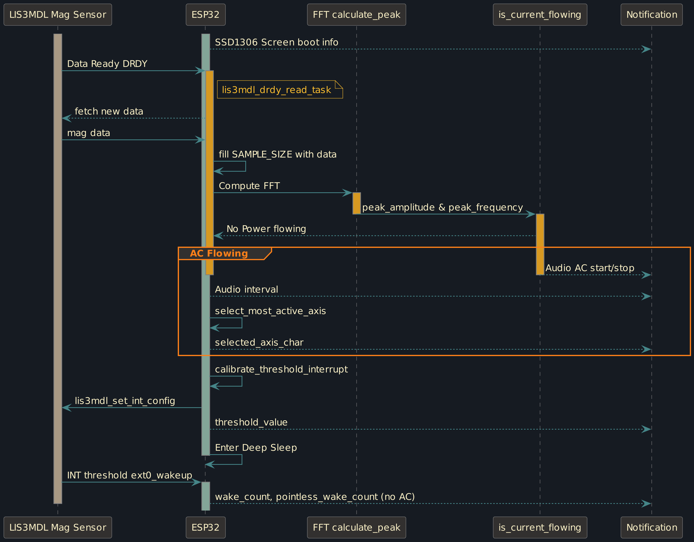

# Airgapped & non-intrusive detection of AC Current with an ESP32

<div style="display: block; max-width: 800px; width: 100%; margin-left: auto; margin-right: auto; margin-top: 20px; margin-bottom: 20px;">
    
</div>


### Objective

This project aims to be able to tell whether current is flowing through a cable (for example leading to a stove), and trigger audio or visual notification upon predefined states. These could include:

- Current started, stopped.
- In set intervals: current still flowing.
- How much current is flowing: currently (Watt), within a given timeframe (kWh -> price).
- Events related to changes in power draw: eg. set oven temperature reached.

### Conditions

There can be no physical contact to the conducting wires and no access to the individual positive or negative wires within the cable: everything related to mains voltage is left completely untouched.

### Disclaimer

This is not a professional solution and should at no point be used to provide a (false) sense of security. Its solely meant as a showcase of the ESP32's DSP capabilities. While it borrows some concepts also used in - for example - arc-fault detection devices, it cannot and will never (with this hardware and setup) come close to the algorithmic features and security implemented in professional installations.

## Working Principle

Whenever an electric current flows through a conductor, such as a cable, it produces a magnetic field around it. The strength and orientation of this magnetic field are directly related to the amount and direction of the current flowing through the conductor.

If we measure the magnetic field around a cable, we could track the changes in measurements. Using standard deviation could provide a measure of how much the magnetic field varies over time to detect the presence of current. This is however susceptible to errors due to external magnetic influences from nearby electrical devices, leading to false indications of current flow. Increasing the sampling period - and thus also the detection latency - can reduce the error rate, during longer tests I could however not reduce the false positives to an acceptable level using this method.

To improve accuracy, analyzing the frequency of the magnetic field oscillations is essential. AC current is generated, and kept stable, around specific frequencies (in most countries 50 Hz or 60 Hz). By identifying and focussing on a stable frequency, we should be able to confidently determine the presence of AC current, distinguishing it from other magnetic disturbances.

## Hardware

The ESP32 dual-core enables concurrent processing of data-collection tasks from the sensor and data-processing tasks, reducing the detection latency. Currently using a ESP32-DEVKITC-32E.

To detect the magnetic field, we could use a hall sensor. As it detects magnetic field along a single axis - and given that we dont have access to a separated single conducting wire - this would however make placement of the sensor critical. While we could arrange multiple hall sensors in different axies, magnetometers mainly used for electronic compass applications come integrated  as 3-axis sensors, allowing them to measure magnetic fields in all three spatial dimensions with a single device. It then doesn't really matter where on the cable the sensor is placed.

The LIS3MDL magnetometer is a fantastic sensor that I choose because of its accuracy, magnetic field range and interrupt features. However it's not anymore readily available anymore, and the sensor is probably currently not the cost-effective choice. Other magnetometers with high enough sampling rates (>150 Hz) should also work fine.

#### Minimal setup and pin assignement

A minimal setup only requires a magnetometer connected using the two lines required for I2C (or more if SPI is choosen). The output could then be read via UART, Bluetooth, WiFi or a simple piezo buzzer could indicate current flow (code is compatible with a piezo, just use the AMP IN+ pin as piezo + input). The project can easily be modified - with some feature limitations (mainly power management) - to not require the magnetometer's DRDY and INT connections.

Currently the project makes use of both a 128x64 OLED Screen (SSD1306) and a speaker with a class D audio amplifier (PAM8302AAD) for notification purposes (code is compatible with a simple piezo), setup with the following pin assignement:

<div style="display: block; max-width: 800px; width: 100%; margin-left: auto; margin-right: auto; margin-top: 20px; margin-bottom: 20px;">
     SCL, IO21 -> SDA, IO4 -> DRDY, IO34 -> INT. The OLED-Screen: IO33 -> SDA, IO32 -> SCL, powered by 3.3v. The amplifier: IO5 -> IN +, IN - -> GND, IO16 -> Shutdown pin, powered by 5v and connected to the speaker + and -.">
</div>

## Software setup

Install [ESP-IDF](https://docs.espressif.com/projects/esp-idf/en/latest/esp32/get-started/) and set up the  esp-idf environment in the terminal session. Navigate to the esp folder and:

```bash
git clone https://github.com/traloph/ESP32-AirGap-AC-Detect
cd ESP32-AirGap-AC-Det
idf.py set-target esp32
# replace PORT with actual port for example /dev/ttyUSB0
idf.py -p PORT flash monitor
```


## Software

The mag values are read by the LIS3MDL sensor, and are normalized accroding to the set magnetic range. The values are collected over a given time period. An FFT analysis is then performed, outputting the amplitudes for the frequency bins. With a sampling rate of 155 Hz we will be able to determine bins around 50 HZ to be able to tell whether a current with such frequency is flowing.

Within a range of 10 Hz a minimum amplitude is set that will be interpreted as current is flowing. When current start flowing an audio signal is played. While current is flowing a sound is played every 30 seconds. When the current stops another sound is played.

### Power Management

When no current is flowing the ESP32 is put into deep sleep. To be waken up when current starts flowing, the LIS3MDL's interupt pin is used. Before, while current  was flowing, the readings are used to calibrate the INT threshold, by detecting the axies with the most activity and a minimum value that will indicate that current is flowing. Before the ESP32 is put into deep sleep, it sets the mangetometers registers to enable the interupt threshold. While the ESP32 is in deep sleep, it will be awoken if the interupt pin is pulled high, further triggering the sampling and FFT check to verify whether current is flowing, or whether the mag value changed because of another reason. We keep track of the times the ESP32 is waken up without current flowing. If the uneccesary wake up ratio is too high, is might be necessary to adjust the settings of the INT calibration.

### Sequence Diagram

<div style="display: block; max-width: 800px; width: 100%; margin-left: auto; margin-right: auto; margin-top: 20px; margin-bottom: 20px;">
    
</div>

<div style="clear: both;"></div>


## Work in Progress features
- Different sound in interval notification depending on mesured amplitude.
- Auto-calibrate condition B (amplitude) & adaptive INT calibration.
- Self-test with 50 Hz frequency injection and action if identification fails.
